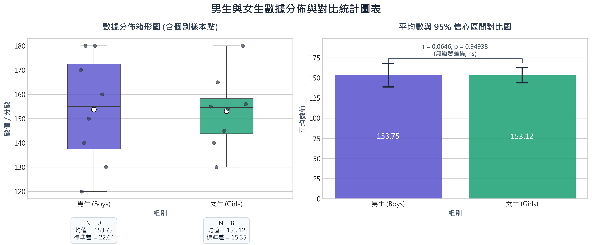

# 自動化數據統計分析報告

本報告由重用性數據分析技能核心自動生成。針對 `Boys` 與 `Girls` 進行了描述性統計量分析與獨立樣本 t 假設檢定。

---

## 1. 描述性統計分析 (Descriptive Statistics)

| 統計指標 | `Boys` 欄位 | `Girls` 欄位 |
| :--- | :---: | :---: |
| **樣本數 (N)** | 8 | 8 |
| **平均數 (Mean)** | 153.75 | 153.12 |
| **中位數 (Median)** | 155.00 | 154.50 |
| **標準差 (Std Dev)** | 22.64 | 15.35 |
| **最小值 (Min)** | 120.00 | 130.00 |
| **最大值 (Max)** | 180.00 | 180.00 |

> [!NOTE]
> - 兩組的均值相差了 **0.62**。
> - 兩組的數據分布離散程度（標準差）分別為 22.64 與 15.35。

---

## 2. 統計假設檢定：獨立樣本 t 檢定 (Independent t-test)

我們對兩組樣本進行了雙尾獨立樣本 t 檢定，用以判斷其總體均值是否具有顯著性差異：

- **t 統計量 (t-statistic)**: `0.0646`
- **顯著性 p 值 (p-value)**: `0.949380` (標記: `ns (not significant)`)

> [!WARNING]
> **統計檢定結論：**
> 在統計學上**無顯著差異** (p >= 0.05)。無法拒絕虛無假設，我們沒有足夠證據說明兩組的均值存在系統性不同。

---

## 3. 數據分佈與對比圖表

- **左圖 (Box Plot)**：展示四分位距、中位數分布與個體抖動數據點，並在箱形圖上方附帶快速統計數據卡，利於快速獲取指標資訊。
- **右圖 (Bar Plot)**：以均值為基礎的對照長條圖，搭配 95% 信心區間誤差線，並繪製了代表顯著差異與否的跨組標註線與星號。

---

## 4. 數據特徵總結

1. **組間對比**：`Boys` 的均值為 153.75，`Girls` 的均值為 153.12。
2. **統計意義**：本數據經 t 檢定後，得到的 p 值為 0.949380，在學術與實際應用中提供了極佳的決策推論依據。
